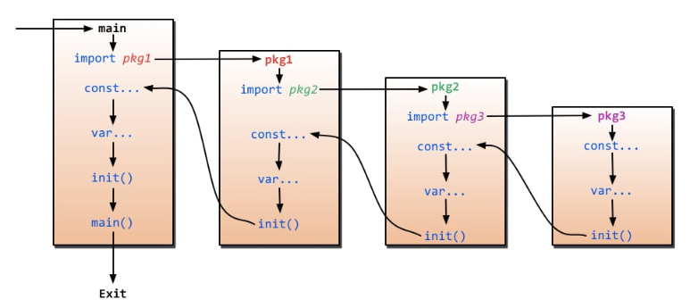

**Пакет** - это папка с набором файлов go. Каждый файл go должен быть частью некоторого пакета.

==*Пакеты в Go должны быть маленькими и многочисленными.*==

- Старайся, чтобы структура каталогов была как можно более плоской. То есть не вкладывай пакеты внутрь пакетов (не всегда используется на практике).

**Типы пакетов**

Исполняемые пакеты:

- В них генерируются исполняемые файлы, которые можно запустить.
- Имя исполняемого пакета предопределено и называется main
- Этот пакет должен иметь функцию с именем main.
- Функция main сообщает go, с чего начать выполнение кода.
- Она не принимает никаких входных параметров и ничего не возвращает.

Неисполняемые пакеты:

- Библиотеки или зависимости, которые используются другими пакетами. Пример — fmt
- Они могут иметь любое имя.
- Их нельзя выполнить как исполняемый пакет, только импортировать.
- Все пакеты, кроме main, являются неисполняемыми пакетами.

### Шаги инициализации

1. Программа начинается с пакета main.
2. Далее идет импорт пакета по списку, начиная с первого в списке.
3. Если в пакете присутствует импорт других пакетов, произойдет импорт по списку, начиная с первого пакета.
4. Далее будут инициализированы константы последнего пакета в дереве импортов (смотри изображение выше).
5. Произойдет инициализация переменных последнего пакета в дереве импортов.
6. Если в пакете присутствует функция init(), произойдет исполнение этой функции.
7. Далее произойдет возвращение в пакет выше. Если в списке больше нет пакетов, инициализация пройдет по тому же сценарию const, var, init().
8. В конце, после инициализации всего дерева импорта пакетов, будет произведена инициализация в пакете main — const, var, init. Затем запустится функция main().